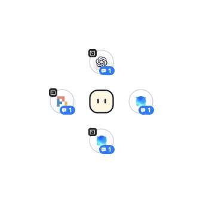
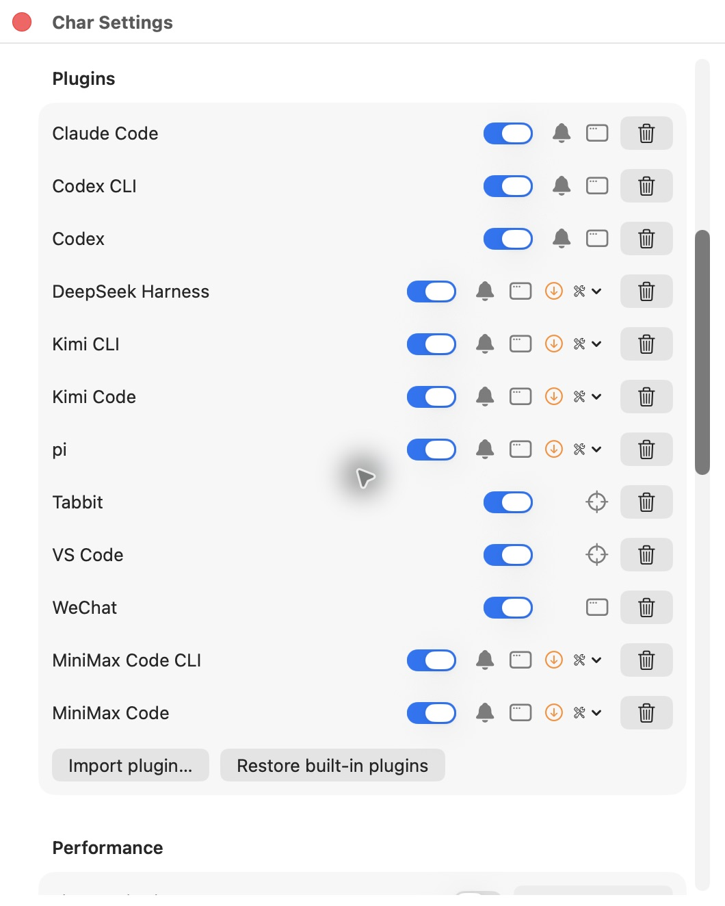
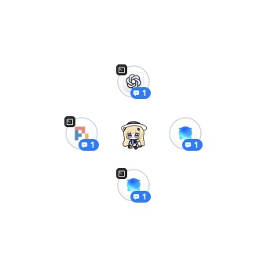

<p align="center">
  
</p>
<h1 align="center">Char</h1>
<p align="center"><strong>Agent 有新状态时看一眼，处理后回到原处。</strong></p>
<p align="center">A local macOS companion for your AI agents.</p>
<p align="center">
  <a href="https://github.com/CheeseFox259/Char/releases/latest"></a>
  <a href="https://github.com/CheeseFox259/Char/actions/workflows/release.yml"></a>
  
  <a href="LICENSE"></a>
</p>
<p align="center">
  <a href="https://github.com/CheeseFox259/Char/releases/latest"><strong>下载 macOS 版</strong></a> ·
  <a href="docs/README.md">完整文档</a> ·
  <a href="docs/development-prompts.md">自定义开发</a> ·
  <a href="https://github.com/CheeseFox259/Char/issues">反馈</a>
</p>

---

Char 把本机 Agent 客户端的新状态聚合成桌宠旁的图标气泡。提问、审批、轮次结束等持续停顿经过过滤后才提醒；点击气泡切到客户端，处理后按 **Ctrl+B 回城**，回到第一次离开的工作界面。来源也可以是另一个 Agent。

## 看见状态，保留工作节奏

- **一个桌宠，多个客户端。** 官方图标标识客户端，CLI 有小终端角标；运行中与结束状态连续过渡，点击查看有破碎反馈。
- **去处理，也能回来。** 连续查看多个 Agent 仍保留首次起点；任意前台应用可应用级回城，插件可提供精确定位。
- **贴合桌面。** 桌面和四边探头，跨屏跟随工作焦点，眼睛跟随、悬停律动、折叠轮换；大小和气泡距离可调，支持减少动态效果。
- **按需扩展。** 导入、启停、更新与卸载插件不需重启 Char；自定义形象支持动画、主题、气泡皮肤、音效和受限脚本。
- **轻量、本地。** 增量读取、预算缓存、原生图层动画与变化才刷新的界面；性能面板按需采样。Char 无网络遥测、不调用模型，提醒不展示消息正文。

<p align="center"></p>

*截图为 v1.0.0 实际界面，使用隔离演示数据，不是用户对话或真实模型触发。*

## 快速上手

1. 在 [Release](https://github.com/CheeseFox259/Char/releases/latest) 下载 Universal DMG，把 **Char.app 拖入“应用程序”**。ZIP 也可解压后复制到 `/Applications/Char.app`。支持 **macOS 13+、Apple Silicon 和 Intel**，无需本地构建。
2. 从状态栏或桌宠右键菜单打开设置，选择中文 / English，调整放置、大小、气泡距离与过滤时间。
3. 使用支持的客户端。pi、Kimi、DeepSeek 在设置 → 插件的维护菜单中安装/更新所属集成，按提示重载客户端。安装 Char 本身不改写客户端配置。
4. **左键气泡 → 处理 Agent → Ctrl+B 回城**。右键可忽略当前提醒。

> macOS 版本目前未经过 Apple 公证，首次启动可能需要在 Finder 中右键应用并选择“打开”

当前发行包采用 **ad hoc 签名**。安装、校验和、macOS 放行及辅助功能/自动化权限见 [macOS 安装指南](docs/macos-release.md)。

默认过滤时间为 10 秒。成功访问清除所点击的提醒，失败保留供重试；“已查看”不表示任务完成。Ctrl+B 只在保存回城起点时注册，结束往返后释放。提醒与回城锚点不跨应用重启恢复。

## 支持哪些客户端

| 客户端 | 接入方式 |
| --- | --- |
| Claude Code | 本地日志 / 可选原生 Hook，[观察集成](docs/observation-integration.md) |
| Codex CLI、Codex Desktop | 本地日志 / 可选原生 Hook，[观察集成](docs/observation-integration.md) |
| Kimi CLI、Kimi Code App | 显式 Hook 与本地 wire，[Kimi 集成](integrations/kimi/README.md) |
| DeepSeek Harness Desktop | 显式被动观察插件，[DeepSeek 集成](integrations/deepseek/README.md) |
| pi | 显式被动扩展，[pi 集成](integrations/pi/README.md) |
| MiniMax Code CLI、Desktop | 随仓库与 Release 提供的[自定义能力插件示例](integrations/minimax-code/README.md)，自行导入 |
| 你的其他客户端 | [开发 `.charintegration`](docs/plugin-development.md)，无需修改或重新编译 Char |

内置 CLI 接入支持直接运行于 **Warp** 与 **Warp + tmux**。其他终端/应用可由自定义插件声明。各客户端的可靠信号不同，未确认的失败或限流不从正文猜测，见 [信号矩阵](docs/signal-feasibility.md)。

### 跳转与回城精度

| 路径 | 当前能力 |
| --- | --- |
| 内置 Agent 气泡 | 激活对应应用最近使用的位置；不宣称会话级精确定位 |
| 任意前台应用，包括其他 Agent | 返回原应用实例，要求原进程仍存活 |
| Tabbit | 原标签；要求自动化授权与标签校验有效 |
| VS Code | 原编辑器或支持的终端标签；要求返回扩展与 token 有效 |
| 自定义插件 | 可提供 visit / origin，必须验证到达后才报告 exact |

跳转精度与首次锚点策略是两个独立规则；首次锚点由宿主保存，插件负责捕获和定位。更多见 [往返规则](docs/attention-trip.md)、[平台接口](docs/platform-integration.md)。macOS 控制整屏 Space 动画，Char 管理自身桌宠与气泡的过渡。

## 自定义插件开发

一个插件可以同时提供 **monitor、visit、origin、lifecycle**，不区分 Agent 与来源软件。v3 能力包使用进程外、版本化本地协议；v1/v2 配置包保持兼容。客户端的 Hook/扩展初次加载可能需要重载，Char 的导入与启停则即时生效。

**给开发 Agent 提需求即可开始**：让它读取 [integrations/AGENTS.md](integrations/AGENTS.md)，描述客户端、CLI/Desktop、期望信号和跳转精度。指令包含工作目录、证据查找、官方图标及上传回退、性能目标、最小基本检查与 GUI 用户验收步骤。开发结束交付可导入包，真实客户端验收交给用户。

- [开发指南](docs/plugin-development.md) · [包格式](docs/integration-plugin-format.md) · [协议](docs/capability-adapter-protocol.md)
- [完整 MiniMax CLI/Desktop 示例](integrations/minimax-code/README.md)：同源码双包、原生常驻入口、共享 Hook、所有权安全维护、官方图标。
- [性能契约](docs/plugin-performance.md)：空闲预算、增量读取、并发/轮转、EOF 排空、按需 helper 与成本归属。

<p align="center"></p>

*实际设置界面，隔离配置；示例需用户导入并安装所属客户端集成，不默认开启真实监控。第三方适配器有当前用户权限，进程隔离不等于沙箱。*

## 自定义形象开发

从参考图或角色需求开始，让开发 Agent 读取 [Resources/Skins/AGENTS.md](Resources/Skins/AGENTS.md)。主题、气泡和交互也由这份指令覆盖；现有集成配置包使用 [Resources/Integrations/AGENTS.md](Resources/Integrations/AGENTS.md)。[三份开发指令入口](docs/development-prompts.md)与[制作流程](docs/appearance-development.md)给出资源标准、生成步骤、基本验收和用户导入步骤。

| 包能力 | 可定制内容 |
| --- | --- |
| v1 图片形象 | 闲置、到达/离开、四边探头等 PNG 动画与软件图标 |
| v2 外观能力 | 每边独立姿态/锚点、跟随图层、主题资源、气泡皮肤、音效、触发条件与受限事件脚本 |
| 宿主公共规则 | 首次锚点、提醒聚合、焦点跟随与窗口管理；通过明确动作接口扩展交互 |

[菲比示例](examples/appearance/feibi/README.md)包含参考素材、生成源码和可直接导入的 `.charpet`；它演示 v1 图片动画，不冒充完整 v2 功能。选中形象同步运行/状态栏图标，并可同步可写的 ad hoc 安装图标；重新签名本机副本可能需要重建辅助功能授权，原 Release 保留备份。

<p align="center"> </p>

两个 MiniMax 包与菲比包均在仓库和 **Release 的 `Char-1.0.0-examples.zip`** 中提供，导入无需命令。完整 API 见 [形象能力参考](docs/appearance-v2-api.md)。形象脚本仅使用 Char 事件/动作，不提供本机命令、网络或文件接口；眼睛/头部跟随需作者提供独立图层。

## 性能

内置客户端共用宿主观察器，**没有每客户端常驻 Node 的成本**。pi/DeepSeek 的事件在现有客户端运行时直接追加，本机隔离实测单条写入中位 **约 0.04–0.05 ms**，不再逐事件创建子进程。

MiniMax 示例的原生适配器 **约 9.6 MiB RSS/端、空闲 CPU <0.01% 单核**；与同条件 Node 参考入口相比，常驻 RSS 约减少 **82%**。维护/导航 helper 按需运行后退出，另计启动峰值。

v1.0.0 隔离呈现样本（默认形象、4 个演示气泡、插件设置可见、20 秒）为 **0.073% 平均单核 CPU、27.6–27.7 MiB RSS**，不含真实日志观察、跨屏焦点查询或外部客户端。

宿主采用 **32 MiB 解码缓存预算**、**512 KiB/文件/批**日志续读与变化才刷新的呈现。缓存预算不等于总 RSS；所有数值为同机具体场景，不是跨设备占用承诺。CPU 100% 表示一个逻辑核心，RSS 包含共享映射。完整测试条件、代价、工具和未测范围见 [性能说明](docs/performance.md)；设置中的[性能面板](docs/performance-dashboard.md)可观察你的实际配置。

## 参与开发

欢迎报告可复现的问题、提交集成/形象包、改进文档或测量性能。开始前阅读 [贡献指南](CONTRIBUTING.md)、[实现架构](docs/architecture.md)与[领域约定](CONTEXT.md)。安全问题见 [SECURITY.md](SECURITY.md)。

需要 macOS 13+、Swift 6 / Command Line Tools；集成检查需要 Node.js 与 Python 3.11+。

```sh
git clone https://github.com/CheeseFox259/Char.git
cd Char
bash scripts/check.sh           # 项目与示例基本检查
bash scripts/build-app.sh       # 开发 app
bash scripts/package-release.sh # Universal ZIP / DMG / SHA256SUMS
```

只修改一个插件时遵循开发指令的最小检查流程，不重复整仓测试。构建示例包见各示例 README。运行开发实例前退出正式实例，日常安装使用 Release。

当前仅提供 macOS 应用；[Windows 移植评估](docs/windows-feasibility.md)说明可复用核心与需替换的平台层。欢迎先在 Issue 中讨论平台适配与接口证据。

## 许可证与素材

[MIT](LICENSE) © 2026 CheeseFox。客户端名称、官方图标及示例角色素材属于各自权利人；代码许可证不自动授予这些素材的权利，见 [示例素材说明](examples/appearance/feibi/ASSET-NOTICES.md)。
