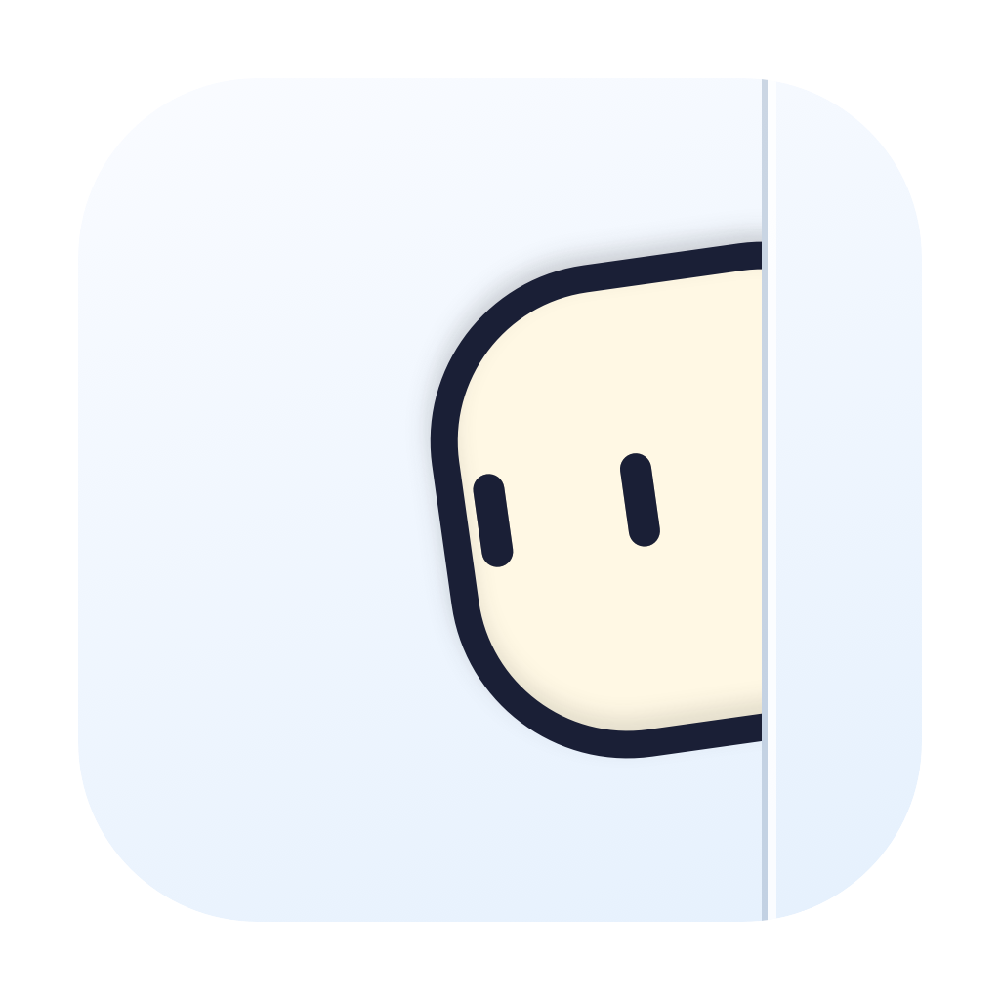

<p align="center">
  
</p>

<h1 align="center">Char</h1>

<p align="center"><strong>看见 Agent 的新状态，处理后回到原处。</strong></p>
<p align="center">A small macOS companion for your AI agents.</p>

<p align="center">
  <a href="https://github.com/CheeseFox259/Char/releases/latest"></a>
  <a href="https://github.com/CheeseFox259/Char/actions/workflows/release.yml"></a>
  
  <a href="LICENSE"></a>
</p>

<p align="center">
  <a href="https://github.com/CheeseFox259/Char/releases/latest"><strong>下载 macOS 版</strong></a> ·
  <a href="docs/README.md">完整文档</a> ·
  <a href="docs/plugin-development.md">开发插件</a> ·
  <a href="https://github.com/CheeseFox259/Char/issues">反馈与建议</a>
</p>

---

Char 是一个在本机运行的 Agent 注意力桌宠。它观察你正在使用的客户端，把提问、审批、轮次结束等新状态聚合成桌宠旁的图标气泡。点击气泡切到对应应用，处理后按 **Ctrl+B 回城**，回到最初的工作界面。

## 为什么用 Char

- **少切几次窗口。** 多个客户端的提醒集中在桌面；CLI 和 Desktop 用终端角标区分，持续停顿经过过滤后才提醒。
- **切过去，也回得来。** 起点可以是浏览器、编辑器或另一个 Agent。连续访问多个 Agent，仍保留第一次离开的界面。
- **轻量的常驻体验。** 增量读取、目录缓存、位图复用和 Core Animation 图层动画减少重复工作；设置预览只更新自己的图层。[性能实测](#性能实测)给出当前资源占用与测试条件。
- **适应你的桌面。** 桌面与四边探头、跨屏焦点跟随、折叠气泡轮换、眼睛跟随和悬停律动；支持 macOS 减少动态效果。
- **本地处理。** 无网络遥测、无模型调用；本地日志在本机解析，气泡只显示状态，不显示问题、命令或消息原文。
- **可以扩展。** 热加载监控、跳转、回城与安装维护适配器，导入自定义形象与软件图标；提供格式校验器、开发指南和可自动读取的开发指令。

## 性能实测

v0.1.2 采用局部预览更新和按变化发布状态。七气泡隔离演示中，设置静止打开的平均单核 CPU 从 **37.79% 降至 2.65%**，下降约 **93%**；桌宠动画仍正常运行。

安装 GitHub Release v0.1.2 后，真实本地观察的短时实测：

| 场景 | 平均 CPU（单核） | 常驻内存 RSS |
| --- | ---: | ---: |
| 常驻观察，设置关闭 | **8.04%** | **78.7–78.8 MiB** |
| 设置静止打开，预览可见 | **6.69%** | **110.7 MiB** |

真实样本为多屏、一个 Codex Desktop 运行气泡、无回城锚点；Tabbit 已授权、辅助功能走未授权回退。两次采样的前台应用条件不同，这张表用于展示占用，不能据此判断打开设置会降低 CPU。[Release 实测记录](docs/release-verification-0.1.2.md)。

以上均为 Char 自身进程占用，100% CPU 表示一个逻辑核心。测试机为 Mac16,12、macOS 26.5.1、10 个逻辑 CPU；每场景采样 20 秒。不同日志数量、形象、权限和显示器条件会影响结果；WindowServer/GPU 与电池功耗未计入。[完整方法、优化机制与验证范围](docs/performance-optimization-2026-10-06.md)。

## 快速上手

1. 从 [GitHub Release](https://github.com/CheeseFox259/Char/releases/latest) 下载 Universal DMG，将 **Char.app 拖入“应用程序”**；也可以解压 ZIP 后复制到 `/Applications/Char.app`。支持 **macOS 13+、Apple Silicon 与 Intel**，安装无需本地构建。
2. 启动 Char，在状态栏或桌宠右键菜单打开设置。选择中文 / English，调整放置、大小、气泡距离、声音和过滤时间。
3. 使用下表中的客户端。pi、Kimi 和 DeepSeek 可在设置 → 插件的维护菜单中安装或更新本地集成；安装 Char 本身不会改写客户端配置。
4. 新提醒出现后，**左键气泡 → 查看 Agent → Ctrl+B 回城**。右键气泡可忽略当前提醒。

默认过滤时间为 10 秒。成功访问会清除所点击的提醒并播放破碎动画；未成功访问的提醒会保留供重试。Ctrl+B 只在保存回城起点时注册，结束往返后释放。

当前发行包采用 ad hoc 签名，尚未 Developer ID 签名或公证。首次打开、更新后的权限、校验和及安装说明见 [macOS 发布指南](docs/macos-release.md)。

## 支持哪些客户端

| 客户端 | 观察方式与接入指南 |
| --- | --- |
| Claude Code | 本地日志 / 可选原生 Hook：[观察集成](docs/observation-integration.md) |
| Codex CLI、Codex Desktop | 本地日志 / 可选原生 Hook：[观察集成](docs/observation-integration.md) |
| Kimi CLI、Kimi Code App | 显式 Hook 与本地 wire：[Kimi 集成](integrations/kimi/README.md) |
| DeepSeek Harness Desktop | 显式观察插件：[DeepSeek 集成](integrations/deepseek/README.md) |
| pi | 显式被动扩展：[pi 集成](integrations/pi/README.md) |

CLI 支持直接运行于 **Warp** 或 **Warp + tmux**。不同客户端可提供的信号不同，详见 [能力矩阵](docs/signal-feasibility.md) 与各集成指南。

### 回城与跳转精度

Agent 气泡目前激活对应应用最近使用的位置。任意前台应用（Char 自身除外）都可以成为应用级回城起点；Tabbit 和 VS Code 在集成、授权与来源校验有效时支持准确返回原标签。

| 起点 | 当前返回能力 | 条件 |
| --- | --- | --- |
| 任意前台应用，包括其他 Agent | 原应用实例 | 原进程仍存活 |
| Tabbit | 原标签 | 自动化授权与标签校验有效 |
| VS Code | 原编辑器或支持的终端标签 | 返回扩展与 token 校验有效 |

准确 Warp pane、Codex 聊天和微信会话导航分别跟踪在 [#10](https://github.com/CheeseFox259/Char/issues/10)、[#11](https://github.com/CheeseFox259/Char/issues/11)、[#12](https://github.com/CheeseFox259/Char/issues/12)。查看完整 [往返规则](docs/attention-trip.md) 与 [平台集成](docs/platform-integration.md)。

## 按你的习惯定制

v0.2.0 支持 v3 能力插件，无需重启 Char 即可导入、启停、同 ID 更新与卸载。原生客户端加载新 Hook 或扩展时可能仍需重载。

桌宠大小 **36–88 pt**、气泡距离 **8–72 pt** 可调，气泡容量随布局自动适配。超出容量时折叠，滚轮循环切换；没有折叠气泡时不滚动。桌宠共享跨屏放置状态，跟随当前工作焦点迁移。

| 想做什么 | 从这里开始 |
| --- | --- |
| 更换客户端图标、名称或目标应用 | [集成配置包 `.charintegration`](docs/plugin-development.md) |
| 接入新 Agent 协议或新的准确回城 | [能力适配器与本地协议](docs/capability-adapter-protocol.md) |
| 制作角色、七种动作及软件图标 | [形象包 `.charpet`](docs/appearance-development.md) |
| 使用 AI 辅助开发 | [三份通用开发指令](docs/development-prompts.md) |

v3集成包可运行独立适配器，接入新监控、跳转、准确起点和安装维护，无需重新编译 Char；旧v1/v2配置与形象包保持纯数据。适配器有当前用户权限，进程隔离不是沙箱。启停立即生效，重新启用只观察新活动；同ID导入更新保留启停状态，删除可选清理所属客户端集成。形象切换同步更新运行中的软件与状态栏图标，Finder 使用安装包内的默认图标。

## 参与开发

欢迎提交可复现的问题、客户端集成、形象包、文档改进和性能测量。[Issues](https://github.com/CheeseFox259/Char/issues) 用于讨论需求与报告问题；提交 PR 前请说明具体行为和已完成的验证。

构建需要 macOS 13+、Swift 6 / Command Line Tools；集成检查还需要 Node.js 与 Python 3.11+。

```sh
git clone https://github.com/CheeseFox259/Char.git
cd Char

bash scripts/check.sh       # 项目检查
bash scripts/build-app.sh   # 开发用 macOS app
bash scripts/package-release.sh  # Universal ZIP / DMG / SHA256SUMS
```

开发包使用生产导入器校验，检查数据写入临时目录：

```sh
swift run char-package-check integration Resources/Integrations/safari.charintegration
swift run char-package-check skin Resources/Skins/example.charpet
```

运行开发包前退出正式实例，避免同时运行多个 Char。日常安装使用 Release 附件。架构、原生数据、协议约束与验证方法见 [实现总览](docs/architecture.md)、[领域术语](CONTEXT.md) 和 [文档索引](docs/README.md)。

## 当前边界

- 当前提供 macOS 构建；Windows 移植需要新的桌面壳和平台适配，见 [可行性评估](docs/windows-feasibility.md)。
- Space 的整屏切换速度由 macOS 控制；Char 只管理桌宠与气泡自身的动画。
- 提醒与回城起点不跨 Char 重启恢复。自定义位图形象尚无默认方块的程序化眼睛跟随能力。
- USB 接收器滚轮已通过实体检查；有线模式的输入送达兼容问题保留在 [诊断记录](docs/wheel-diagnosis-2026-10-05.md)。

## 许可证

[MIT](LICENSE) © 2026 CheeseFox。Agent 名称与图标属于各自权利人。
