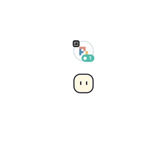
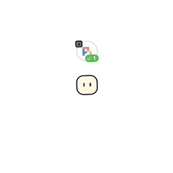

# 气泡状态连续性修复

日期：2026-10-06；目标版本 v0.2.1。

## 复现与原因

对真实 AttentionRouter 输入 running(0s) → stopped(turnEnded, 1s)，使用默认 10 秒过滤阈值。`swift run char-core-checks` 中新增回归检查在 1 秒时失败：预期保留 claudeCode 气泡，实际工作端列表为空。

旧快照仅聚合注意力项和 runningCount：进入 stopped 后运行计数立即为零，注意力项直到 11 秒才创建，因此这 10 秒期间气泡被移出布局。单会话即可复现，不依赖 Warp、tmux、鼠标或原生事件写入。

## 修复

- 会话记录是否在当前观察周期见过 running。停顿过滤期间将这些未确认会话聚合为 pendingCount，保留原气泡及槽位；初始仅见停顿的会话仍按原过滤规则处理。
- pendingCount 不产生注意力项，不触发提醒音，也不会变成可提前确认的提醒。达到阈值、恢复运行、精确焦点确认、关闭、忽略或停用继续由原状态规则处理。
- 壳体和 Agent 图标缓存独立于状态标记。状态图层用 CATransition.fade（280 ms，自定义缓入缓出）以及 320 ms 的小幅压缩/拉伸变化衔接；图标和整泡透明度不变化。Core Animation 实际用 `transition` 键存储 CATransition，原生断言检查该键。
- 状态图层继承气泡的闲置、悬停与轮换变换；点击破碎使用完整组合图像。减少动态效果时只做 120 ms 短淡化。没有新增计时器、轮询或每帧位图绘制。

## 已完成检查

- `swift run char-core-checks`：新增失败复现转为通过；覆盖完整过滤间隔、恢复、忽略、精确焦点与关闭。
- `bash scripts/check.sh`：项目完整门槛通过。初次复跑的旧增量 observation binary 在 AttentionBubble.count.getter 崩溃；清理 Swift 构建缓存后重编译，观察器与最终完整检查通过。没有修改观察器检查。
- `build/Char.app/Contents/MacOS/Char --smoke --bubble-state-check`：三次运行→过滤停顿→结束→恢复，原气泡可见性、槽位、壳体 CGImage 身份、实际状态图层动画、破碎图像与 Reduce Motion 通过。
- 完整 `--smoke`：此前的导航、插件、Space、形象和气泡交互门槛通过。
- CUA 隔离演示：实际看到运行、等待确认与轮次结束状态，切换期间壳体、图标和布局稳定。下图是不同状态的实际帧。

| 运行中 | 轮次结束 |
| --- | --- |
|  |  |

演示使用模拟事件与私有配置，不激活用户 Agent 或发起模型请求。实际客户端信号仍取决于各自适配器；本修复针对共同的聚合及呈现路径。发布附件与正式替换的最终检查单独记录在版本验证报告。
