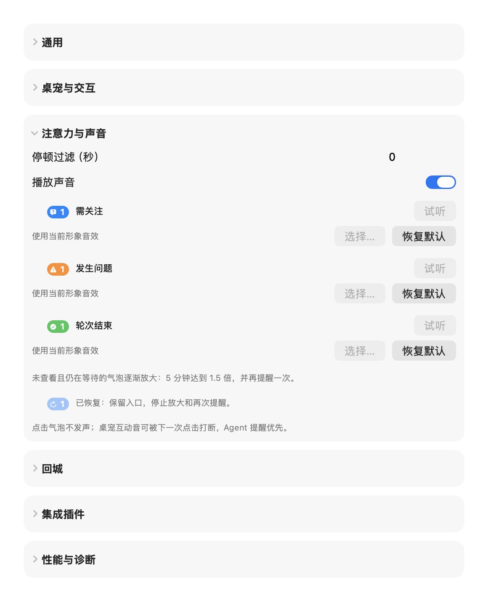

# 2026-10-08体验重构验证记录

实现范围：原因提醒音、互动抢占、5分钟气泡强化、桌宠动作/可见性所有权、菲比姿态/眼眶跟随、设置分类和schemaVersion 2可选扩展。基线为c90fbb8；没有提交、推送或发布。

## 问题与修复

| 原问题 | 原因与本轮处理 |
| --- | --- |
| 不同原因共用声音 | 泛化发声效果丢失停顿原因；AttentionFeedback输出停顿身份、原因、类别和阶段，CompanionAudio合并后按类别串行、抢占互动。 |
| 长期等待没有强化 | 首次逻辑提醒时间属于宿主内存记录，最早等待项驱动44→66pt cubic ease-out；300秒一次再次提醒，静音消耗机会但仍发形象事件。 |
| 桌面拖放闪现 | 同模式移动也执行完整迁移；生产拖动提交进入CompanionPresentation，与检查共用策略，新位置保留，吸边从当前窗口位置过渡。 |
| 贴边idle只剩头、悬停突然有身体 | idle使用空白身体帧；菲比各动作复用真实身体。后续曝光收至肩部，固定usable desktop mask表达遮挡，新增独立白色渐变边界及柔光。 |
| 旋转/锚点提前裁掉像素 | 真实按钮大小既作命中又作位图边界；位图扩展，交互区域保持独立，scene变换与命中一致。 |
| 眼部跟随几乎不可见 | 原travel默认48pt不足0.3pt；分离双瞳孔，约1pt位移、眼眶遮罩、方向逆变换和眨眼换层。 |
| Space慢、偶发重复与跳屏 | 首轮0.16秒恢复仍在用户实机中复现。后续日志确认可见性清零和跨屏迁移叠加；本轮取消宿主恢复变换，焦点屏幕稳定后才跟随。真实快速Space仍需新版本复验。 |
| Claude退出后残留运行 | native `/exit`与退出stdout均写成user记录，被误当成新运行；识别exit/quit本地命令封套为closed，忽略stdout；不按聊天文字或无活动超时猜测结束。 |

## 已通过

- `bash scripts/check.sh`：Core设置/提醒/回城/几何、观察器、平台与插件、Hook、JS适配器、脚本协议、示例集成/菲比生产包和公共文档检查。Core覆盖0/60/299/300/301秒、新增/忽略/恢复、静音机会、原因变化、刷新与新停顿身份。
- 原生`--feibi-check`：日夜×五放置×36/48/88pt共30组；48pt八方向像素变化、眨眼、透明端点、动作接缝、帧层缓存刷新、变换命中、66pt增长范围、实际窗口拖动提交、中英文设置截图及可启停的通知时间线写入。
- 同一原生检查以静音NSSound探针验证零冷却连续播放、提醒抢占互动、提醒期间点击抑制、三类别顺序及delegate队列完成。这证明播放调用/顺序，未代替人耳试听原声。
- 生成器离线预览与严格包校验：18条MP3、15条随机互动池、138个唯一PNG、26.91MiB理论RGBA、52,949字节清单、368帧引用。所有文件受引用，无未用文件。
- Claude生产poller→router回放：修改前明确失败“Claude /exit and its stdout left a stale running bubble”；只修exit仍失败，排除stdout后通过。保留quit、普通自定义slash命令检查；没有导出聊天正文。
- 两条审查：规范没有硬性违规；拖动seam生产使用和重复图层几何已修正。需求复查的静止鼠标增长命中、静音事件独立、错误分类归属均已修正；提醒发声许可贯穿绑定及异步脚本，静音撤销在途许可，最终需求复查通过。
- 同条件release前后CPU、physical footprint与图片缓存样本，详见[菲比性能记录](../examples/appearance/feibi/PERFORMANCE.md#2026-10-08体验重构对比)。

## 真实窗口观察

通过原生电脑控制查看默认形象/菲比设置、菲比桌面及上边缘。六类折叠、状态小图形、完整桌面身体、上边缘头和上半身，以及等待五分钟后的大泡/紧凑折叠泡均已看到。下面为同一原生设置视图的中英文隔离检查之一；demo中的试听/选择按钮按演示规则禁用。

## 未运行与限制

真实连续鼠标拖动、真实八方向跟随手感、多显示器迁移和受控快速Space切换交由[人工验收](experience-acceptance.md)。电脑控制drag返回AXError.notImplemented；Space快捷键尝试未形成可确认的受控切换。原生检查期间已记录可见性/工作区通知，但没有受控重现原先偶发重复播放，不能认定所有系统时序已排除。

无SessionEnd、退出日志或可靠进程身份的强制终止无法由当前日志源证明。关闭窗口/杀进程的Claude场景需单独确认信号。形象新字段保持schemaVersion2，但严格旧宿主会拒绝；使用新包必须配套本轮宿主。源码/资源/可运行独立验证版已交付，实机验收仍待用户运行。本轮不新增通用行为插件类型，不替换渲染技术。

## 用户反馈后的肩部/Space修正

用户实机日志捕捉到occlusion后opacity=0再恢复，以及frame横坐标85与1775附近往返且moving=true。原因分别是宿主把结果通知用于隐藏/恢复，以及Space附近立即跟随临时前台窗口几何。

本轮取消Space/遮挡对透明度、缩放和缩回的控制；系统显示当前场景。CompanionPresentation改为在通知期间暂缓屏幕选择，候选稳定0.45秒后才迁移。菲比edgeInset由0.20收至0.09，探出遮挡落在肩部；可选edgeBoundary由原生绘制白色中央粗/两端细的渐变光线及低透明度柔光，独立于固定身体裁切、不进入命中。设置采用直接的整行折叠Button，可点击标题及空白，并报告展开/折叠辅助功能状态。

检查记录：修改前Core通知重入检查失败，修改后通过；原生40轮乱序通知检查保持opacity=1、scale=1、retraction=0且不移位；项目完整检查通过。真实多屏快速Space仍由用户复验，不能用通知重放替代。四边原生截图最初固定等待不足，现按完整放置播放时长后再断言idle，完整检查已通过；桌面拖动检查也明确从可用桌面中间开始，避免把边缘位置夹取当成拖动回退。最终设置副本经CUA真实点击回城标题行空白，已确认Expanded→Collapsed；同一宿主新版本的标题均为辅助功能Button并报告展开状态。

最终检查：完整项目checks、默认形象/能力插件GUI smoke、菲比30组绘制及四边稳定scene、40轮原生通知重入均通过；标题行空白点击已在原生窗口确认。原生通知重放及Core用户日志夹具不会修改用户安装或配置。
