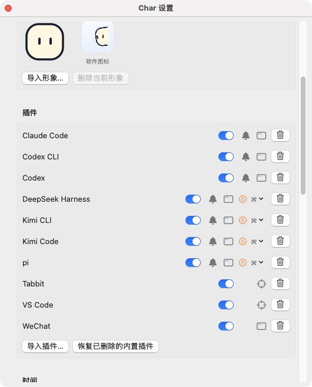

# Char v0.2.0 发布与替换验证

日期：2026-10-06。使用者明确要求发布并替换。本记录描述已执行的步骤。

## 发布来源

- [PR #19](https://github.com/CheeseFox259/Char/pull/19) 已合入 main。tag `v0.2.0` 指向 `30cdad950969129e0b3fbe4a5f9edbca20875dd5`；版本 0.2.0，build 4。
- [Actions 37424647725](https://github.com/CheeseFox259/Char/actions/runs/37424647725) 成功：版本检查、完整项目检查、Universal 构建、ZIP/DMG/签名/双架构校验与草稿上传。
- [Release v0.2.0](https://github.com/CheeseFox259/Char/releases/tag/v0.2.0) 已于 `2026-10-06T06:40:35Z` 公开发布并设为 Latest。

| 附件 | SHA-256 |
| --- | --- |
| Char-0.2.0-macos-universal.zip | `bc4cd3ebd7c8603367c67461699d4d9b7b9b2caf9c6bf1a3de66181b5dcd89cf` |
| Char-0.2.0-macos-universal.dmg | `a9b0cc33f43ae03673b69a0917ff8122ccd268b265e8f62030c45567bab15091` |

## Verified

- 使用 `gh release download v0.2.0 --repo CheeseFox259/Char` 下载实际附件；公开后重新下载 ZIP 和 SHA256SUMS。校验和、strict deep codesign、Info.plist 版本、Char/char-hook 的 arm64/x86_64 以及 `hdiutil verify` 通过。
- 下载的正式产物执行完整 `--smoke` 通过，包含 Space 到达检查与能力插件路径。安装后的 `/Applications/Char.app/Contents/MacOS/Char --capability-smoke` 通过。所有导航目标为 fixture，使用临时数据。
- 旧 v0.1.2 应用与 Char 数据私有归档于忽略目录 `build/installation-backups/v0.2.0-2026-10-06/`；归档权限 0600。退出旧进程，从 Release 解压 bundle 替换 `/Applications/Char.app`；与下载 bundle 的 `diff -qr` 相同，签名仍有效。没有安装本地构建。临时解压、开发和旧应用 bundle 已清理，回滚 ZIP 保留；只保留一个正式安装和运行实例。
- 实际设置检查：中文、右边缘、48 pt、18 pt、默认形象、过滤 10 秒、回城宽限 300 秒与内置插件开启保留。首次起点和应用级起点选项可见；登录时启动为“已启用”，Tabbit 为“已授权”。
- 在正式设置的维护菜单更新 pi、Kimi CLI/App 与 DeepSeek 的既有集成（延续此前安装授权）。所属配置指向当前用户 `~/Library/Application Support/Char/runtime/`，备份位于其中的 `integration-backups/`。UI 显示“需要重载客户端”。
- 对实际安装配置调用 bundled native adapter 的 hello/inspect：pi、Kimi CLI、Kimi App、DeepSeek 均返回 ready。这仅核对配置与资源，不证明已有客户端加载新版本。
- 与本次更新前的对应备份比较：Kimi 仅 Char 命令变化，其余设置、Hook 字段保留；DeepSeek 中 Char entry 外的字节不变。最初审计脚本误选了 2026-10-04 的历史备份并失败；改为选择本次插件 ID 对应备份后通过，没有据此改用户配置。
- CUA 实际观察维护状态、保存下图，关闭设置后正式桌宠继续运行。

## Not run

- 更新后真实 pi、Kimi CLI/App、DeepSeek 自然事件验收；未替使用者发起模型请求或重启工作会话。需要使用者安排客户端重载。
- Intel 实机、真实注销/登录、长期整体性能与电池/GPU测量。本阶段未将 v0.1.2 性能数据冒充新版本实测。
- 第三方真实客户端的准确窗口/会话导航；接口证据来自独立适配器 fixture。

## Blocked / Not applicable

发布与安装无阻塞。新版实际辅助功能状态为“未授权（可选）”，需要使用者在系统设置中移除旧 Char 记录并重新添加 `/Applications/Char.app`；本次未修改 TCC。Tabbit 自动化仍有效。

Developer ID 签名与公证不在当前发布配置中；产物为 ad hoc 签名。整屏 Space 动画由系统管理，当前只验证 Char 自身的呈现生命周期。
