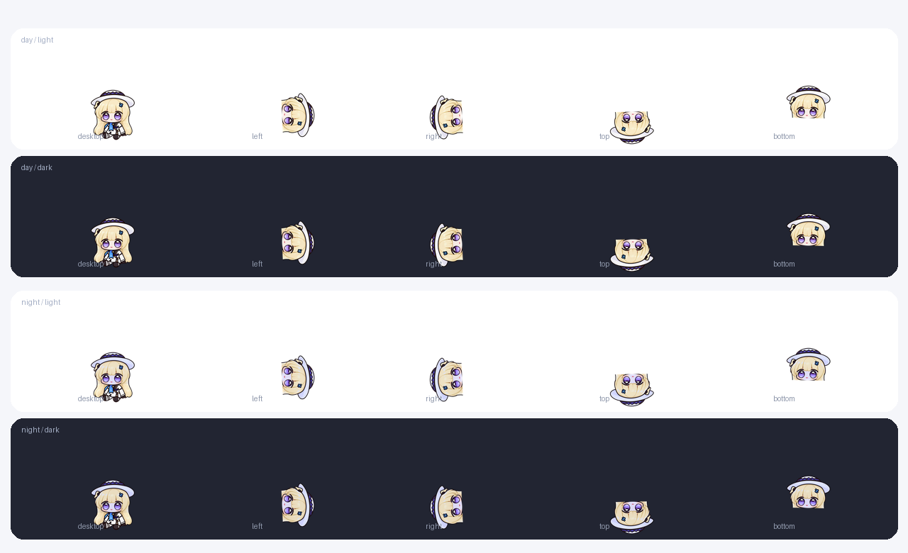
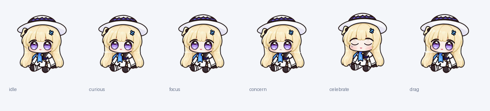

# 菲比 · Char 官方外观示例

一个有呼吸、眨眼和克制转头的 Q 版桌面伙伴。日光保留金白蓝，月夜添入柔和蓝紫光影；主题由你手动选择。






## 使用与验收

本示例使用新的分层同步接口，需要本次配套宿主；当前 Release 尚未包含该接口。请使用[本地验证版和 GUI 步骤](USER-ACCEPTANCE.md)，不要在现有正式版中导入新版包。本阶段不发布 Release、不自动替换已安装应用或形象。

包：`packages/feibi.charpet`；ID：`feibi.pet`。导入后选择“菲比 · Phoebe”，主题为“日光”或“月夜”。启用脚本后有原生事件表情联动；拒绝脚本仍保留主题、动画、跟随、气泡皮肤、音效和拖拽/回城绑定。

## 能力

| 功能 | 表现 |
| --- | --- |
| 动作 | 七组基础动作，以及好奇、专注、担忧、开心、拖拽；192×192、30 fps |
| 原生跟随 | 身体、头部、眼白/眼睑、两眼虹膜/高光分层与眼眶遮罩；48pt最大瞳孔位移约1pt；眨眼关闭虹膜层 |
| 四边 | 各边独立时间线、倾斜、锚点、旋转与镜像；探出末帧与闲置首帧连续 |
| 主题 | 日光与月夜，独立透明头部层、气泡资源和1024×1024探头图标 |
| 气泡 | 透明外壳、银灰轮廓和主题点缀；保留 Agent 图标，定制终端角标、状态色、字体、悬停、破碎和弹性轮换 |
| 事件 | 悬停专注/离开闲置；提问与审批好奇，失败等问题担忧，轮次结束开心；按客户端去重 |
| 声音 | 需关注phoebe_0，问题phoeba_chubby_1，轮次结束phoebe_chubby_4；其余15条随机桌宠互动，55%音量、零冷却、可打断；气泡点击静音 |
| 布局 | 紧凑16pt气泡距离、最多6个、边缘130°弧；贴合角色的命中区域 |
| 用户控制 | 默认点击跳转、焦点跟随和用户回城策略；可关闭“使用形象行为偏好” |

脚本仅处理事件、返回动作和去重，不逐帧运行，不自动换主题、移位置、忽略提醒或修改导航。实际出现哪类表情取决于客户端插件提供的真实结构化信号。

## 制作自己的角色

让开发助手读取[完整外观开发指令](../AGENTS.md)，提供参考、主题、动作和行为需求即可。完整接口见[外观 API](../../../docs/appearance-api.md)。此例演示分层制作、同步变换、状态换眼、主题复用与事件脚本，作者可按需求减少能力。

`art/master.png` 是精修基准，`reference/` 保留角色来源，`generator/` 是可重现的分层、动作、图标和预览生成器，`audio/` 保留原声与许可。`packages/` 只含运行资源。

在仓库根重建（Python3、Pillow、NumPy）：

```sh
python3 -m venv build/feibi-venv
build/feibi-venv/bin/pip install -r examples/appearance/feibi/requirements.txt
PYTHON="$PWD/build/feibi-venv/bin/python" sh examples/appearance/feibi/generator/make.sh
```

从任意目录运行 `generator/make.sh` 均解析到本工作区。生成后一次生产校验；本地预览及预算写入 `preview/`、`reports/`，不提交临时报告。构建配套验证 App：`bash scripts/build-appearance-preview.sh`，输出 `build/feibi-preview/Char.app`，独立配置存储在相邻 `Profile/`。

## 预算与验证口径

138个唯一PNG，理论裸RGBA **26.91 MiB**，包含两个1024图标；帧、身体与没有改变的资源复用。此数字不是宿主RSS。基本验收覆盖两主题、五种放置、36/48/88pt、黑白背景、动作接缝、跟随/眨眼及透明端点；原生渲染、脚本和图标备份另做定向检查。跨屏/Space、声音、Finder缓存与实际手感由用户GUI验收。性能条件与结果见[性能说明](PERFORMANCE.md)。

## 素材来源

角色参考由使用者提供，精修基准经图像生成后由确定性分层和动画生成器制作。原角色及相关权利属于原权利人。语音来自 [Genius-Society/phoebe_chubby](https://github.com/Genius-Society/phoebe_chubby)，保留 CC BY-NC-SA 4.0，未剪辑或转码。Char“官方示例”表示由项目维护，不表示与角色权利人的官方合作。项目 MIT 许可适用于代码，素材权利见[素材说明](ASSET-NOTICES.md)。

贴边曝光为肩部（edgeInset=0.09）；edgeBoundary声明原生白色渐变边界与低透明度柔光。边界固定在可用桌面边缘，不进入交互区域。Space转场由系统负责，形象脚本不重播进场。
